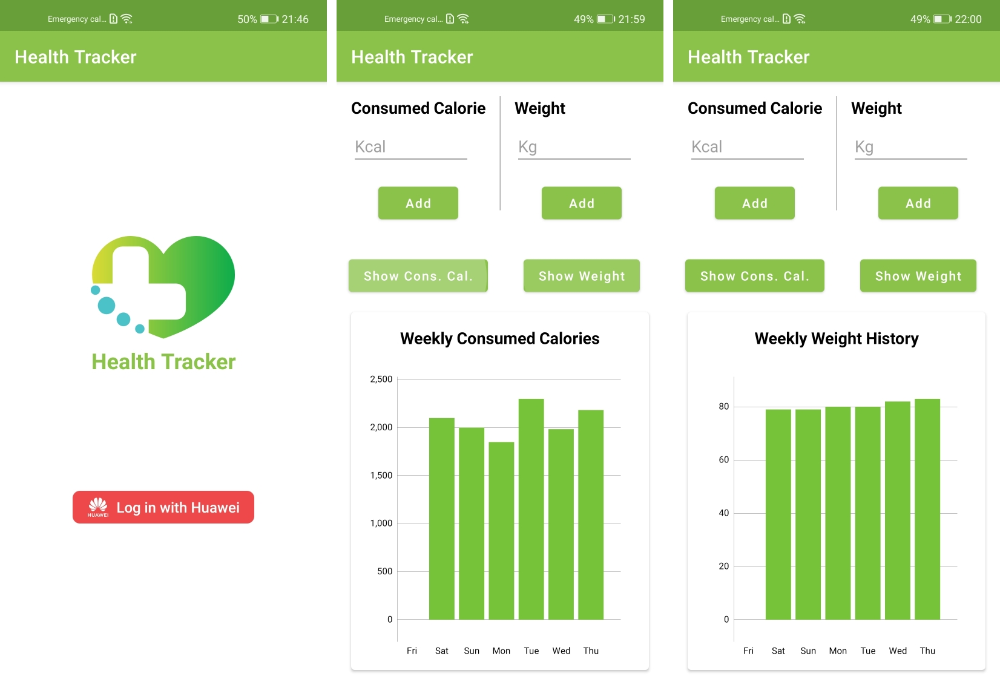

# Health Tracker App

## Introduction

Health Tracker is an Android App for tracking calories and weight of people using Huawei Health Kit.  

A detailed explanation is available at medium article;

Language | Link
------------- | -------------
TR  | [TR-Developing Calorie Tracker App with Huawei Health Kit](https://medium.com/huawei-developers-tr/huawei-health-kit-ile-kalori-takip-uygulamas%C4%B1-geli%C5%9Ftirme-de0fb9880910)
EN  | [EN-Developing Calorie Tracker App with Huawei Health Kit](https://medium.com/huawei-developers/developing-calorie-tracker-app-with-huawei-health-kit-37345ee4271c) 

## Screenshots

## Features
- Log In with Huawei Account easily
- Add your intake of calorie and weight information
- Show the records on the bar chart weekly

## Kits Used
- [Huawei Account Kit](https://developer.huawei.com/consumer/en/doc/development/HMSCore-Guides/introduction-0000001050048870)
- [Huawei Health Kit](https://developer.huawei.com/consumer/en/doc/health-introduce-0000001053684429-V5)

## Libraries Used
- [MPAndroidChart](https://github.com/PhilJay/MPAndroidChart)
